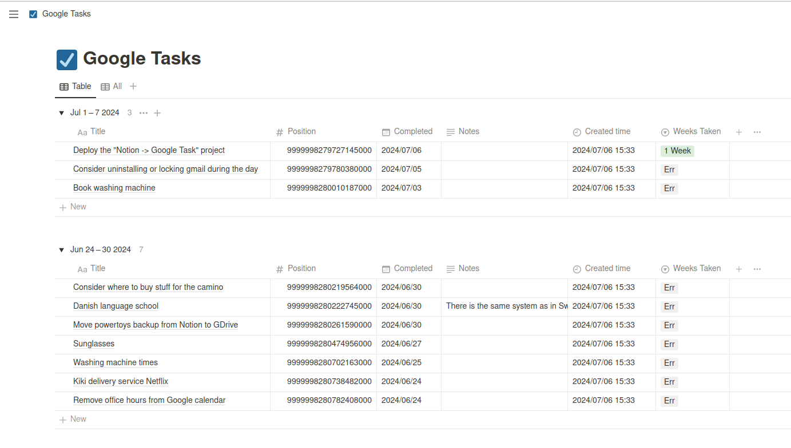

# Tasks fetch

Import **Google Tasks** to **Notion** and show how much time it took in weeks.

**Python version: 3.12**

Virtual environment:
- `pyenv virtualenv 3.12.0 tasks-fetch`
- `pyenv activate tasks-fetch`

## Setup

Get files:
- *clinet_secret.json.example* -> *clinet_secret.json*  
https://console.cloud.google.com/welcome  
-> APIs & Services  
-> Credentials  
-> OAuth 2.0 Client IDs  
-> (new: Desktop)
-> Download JSON  

- *.env.example* -> *.env*  
https://www.notion.so/profile/integrations

TODO: UPDATE THIS SENTENCE
**Docker Warning**: image creation can't be automated with github actions: even with credentials.json the script requires tocken.pickle generated through a browser and login with google account, and refreshed once in a while. It works by creating a local server and waiting for the response at 127.0.0.1, and the 'copy-paste' the link from the terminal to the browser does not work.
